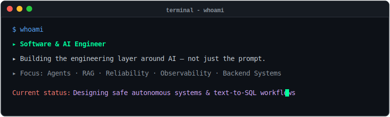
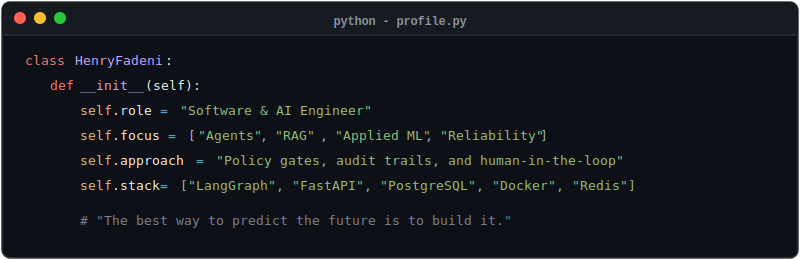

<div align="center">

<!-- Animated Banner -->
[](https://git.io/typing-svg)

<br/>

[](https://github.com/Protagonist01)
&nbsp;
[](https://github.com/Protagonist01?tab=followers)

</div>

<br/>



<br/>

---

## About Me



<br/>

---

## Tech Stack

<div align="center">

**`$ query --stack ai-ml`**


<br/>

**`$ query --stack backend-web`**


<br/>

**`$ query --stack devops-infra`**


</div>

<br/>

---

## Featured Projects

```text
$ tree projects/
├── 🤖 self-healing-monitor [active]  - AI-assisted SRE runbook remediation
├── 🔍 code-review-agent    [stable]  - Autonomous GitHub App for PR reviews
├── 📊 analytics-dashboard  [active]  - Natural-language to DuckDB text-to-SQL
├── 🍃 feijoa-ml-pipeline   [archived]- TensorFlow & Scikit-learn quality system
├── 🛍️ aboutface-rag        [stable]  - Pinecone-grounded brand assistant
└── ✅ smart-todo-cli       [stable]  - Regex-powered task manager CLI
```

### 🤖 &nbsp; [Self-Healing Monitor](https://github.com/Protagonist01/self-healing-monitor)
> AI-assisted SRE system -- receives Prometheus alerts, retrieves runbook context, diagnoses incidents, and routes remediation through **policy gates, audit logs, and human approval**.
>
> **Stack:** `Python` · `LangGraph` · `FastAPI` · `Prometheus` · `PostgreSQL` · `Docker` · `React`

### 🔍 &nbsp; [Code Review Agent](https://github.com/Protagonist01/code-review-agent)
> Autonomous GitHub App for PR review -- HMAC webhooks, Celery/Redis job handling, **LangGraph review flow**, inline comments, commit statuses, and swappable LLM backends.
>
> **Stack:** `FastAPI` · `Celery` · `Redis` · `LangGraph` · `Docker` · `OpenRouter` · `Ollama`

### 📊 &nbsp; [RAG Analytics Dashboard](https://github.com/Protagonist01/retrieval-augumented-analytics-dashboard)
> Natural-language to SQL analytics platform -- generates validated SQL, runs it in a **sandboxed DuckDB layer**, streams charts and AI explanations, includes an evaluation harness.
>
> **Stack:** `Python` · `FastAPI` · `Next.js` · `DuckDB` · `Redis` · `SSE`

### 🍃 &nbsp; [Feijoa ML Quality System](https://github.com/Protagonist01/feijoa-classification-and-weightloss-prediction)
> Two-model quality pipeline -- **MobileNetV2 classification** + Random Forest regression, FastAPI inference endpoint, Supabase storage, and Hugging Face model hosting.
>
> **Stack:** `TensorFlow` · `Scikit-learn` · `FastAPI` · `Supabase` · `Vercel`

### 🛍️ &nbsp; [About Face RAG Chatbot](https://github.com/Protagonist01/aboutface-chatbot-demo)
> Brand-aligned e-commerce assistant -- grounds product, shade, shipping, and usage answers in a **Pinecone-backed knowledge base**.
>
> **Stack:** `Node.js` · `Express` · `Pinecone` · `OpenAI` · `Vercel`

### ✅ &nbsp; [Smart Todo CLI](https://github.com/Protagonist01/smart-todo-app)
> Python CLI task manager with **natural-language parsing**, tags, priorities, dates, assignments, search, persistence, and a large automated test suite.
>
> **Stack:** `Python` · `Poetry` · `Regex` · `Pytest`

<br/>

---

## GitHub Stats

<div align="center">


&nbsp;


<br/><br/>


&nbsp;

&nbsp;


</div>

<br/>

---

## ⚡ &nbsp; Recent Activity

<!-- START_SECTION:activity -->
<!-- END_SECTION:activity -->

<br/>

---

## Currently Exploring

```text
[ ] 🔬 Eval-driven AI  ▸ Building text-to-SQL accuracy harnesses & safety checks
[x] 🛡️ Safe agents     ▸ Deployed self-healing infrastructure patterns
[/] 🔒 Private LLMs    ▸ Integrating local Ollama setups for offline runs
[ ] 📡 Observability   ▸ Setting up structured tracer loops & explanation queues
```

<br/>

---

## Get In Touch

<div align="center">

`$` ssh [linkedin/henry-fadeni-ai-engineer](https://www.linkedin.com/in/henry-fadeni-ai-engineer)  
`$` curl [hfadeni@gmail.com](mailto:hfadeni@gmail.com)  
`$` ping [portfolio](https://github.com/Protagonist01) `// coming soon`

</div>

<br/>

---

<div align="center">

*The best way to predict the future is to build it.*

<br/>


<br/>

</div>
